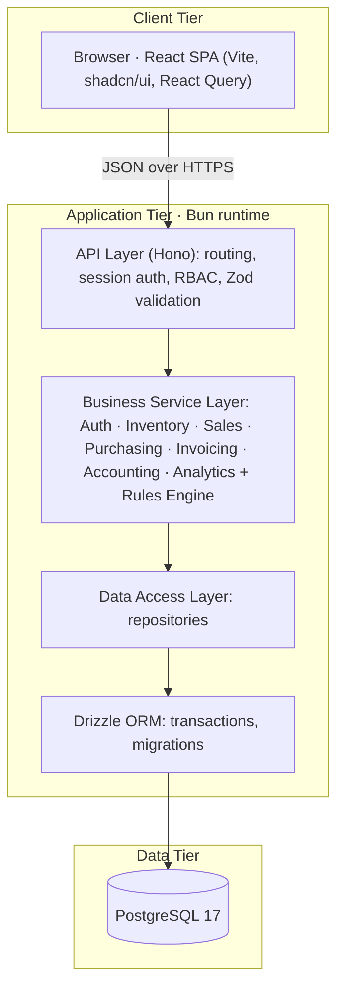
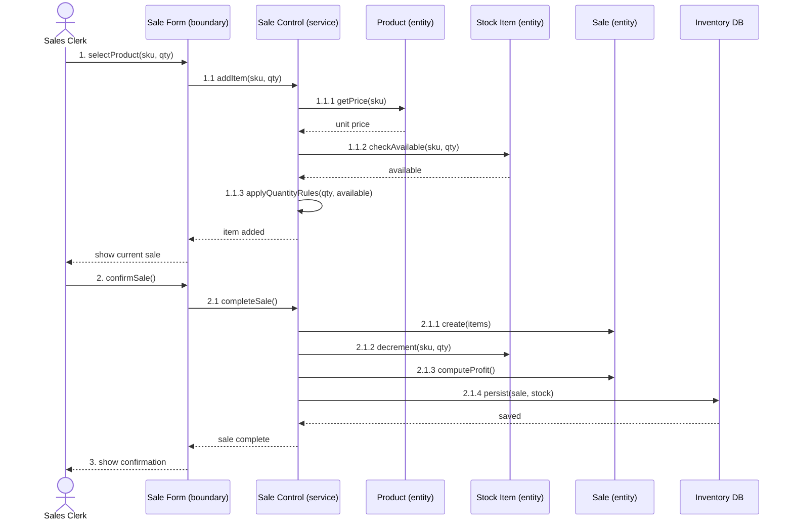
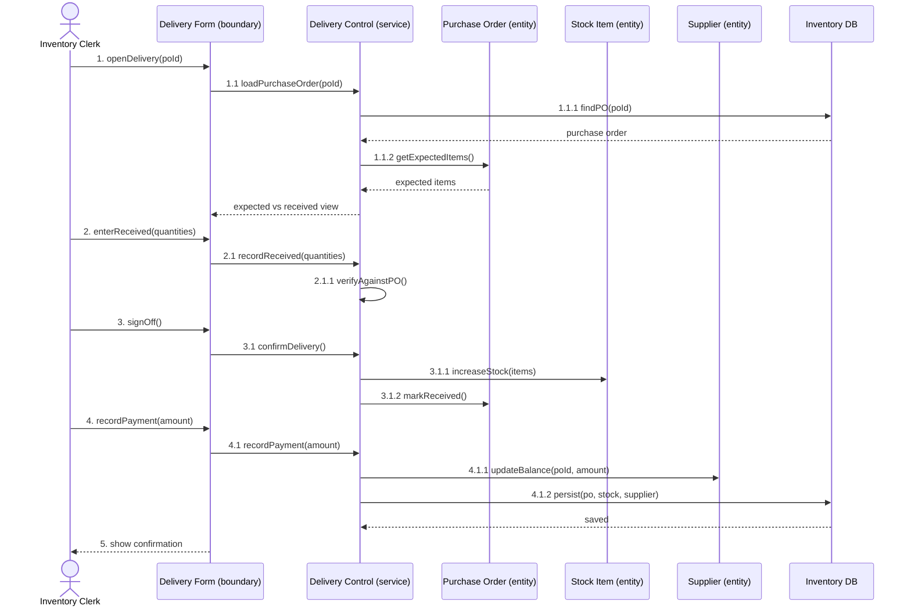
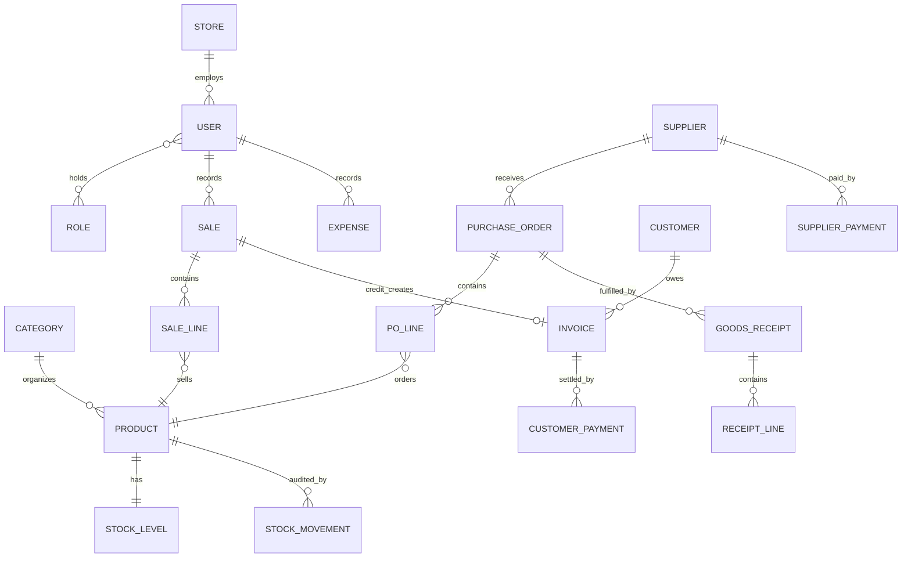

# ShelfLife — General Store Management System

**Author:** Joseph Everest Lyimo · **Student ID:** 618981
**Course:** CS425 Software Engineering

ShelfLife is a store and inventory management system for a single general retail
store. It tracks inventory from bulk purchase to unit sale, records sales at
manager-controlled prices, manages suppliers and purchase orders, invoices credit
customers, records expenses, and computes per-item profit. A role-based
permission system controls what each employee sees and does.

This README describes the project from the first idea to the final product. It
follows the RUP artifact chain: Vision → SRS → Architecture → Design → Code →
Tests.

---

## Table of contents

1. [Project overview](#1-project-overview)
2. [Vision document](#2-vision-document)
3. [Software requirements (SRS)](#3-software-requirements-srs)
4. [Use-case model](#4-use-case-model)
5. [System architecture](#5-system-architecture)
6. [Design diagrams](#6-design-diagrams)
7. [Domain model and database schema](#7-domain-model-and-database-schema)
8. [Technology stack](#8-technology-stack)
9. [Application-layer structure](#9-application-layer-structure)
10. [Business rules and core algorithms](#10-business-rules-and-core-algorithms)
11. [Installation and execution](#11-installation-and-execution)
12. [Database setup](#12-database-setup)
13. [Automated tests](#13-automated-tests)
14. [Screenshots](#14-screenshots)
15. [Security](#15-security)
16. [Known limitations and future work](#16-known-limitations-and-future-work)
17. [Repository map](#17-repository-map)
18. [Documents](#18-documents)

---

## 1. Project overview

### Problem

A general store starts small. One owner tracks stock, sales, and expenses in a
notebook. This method fails as the store grows. The store now carries hundreds of
products, employs several people, buys from several suppliers on credit, and
extends credit to customers. Stock counts drift out of sync. Fast-moving items run
out without warning. Profit becomes hard to compute when goods are bought in bulk
but sold as single units. No one has a reliable picture of the store's finances.

### Purpose

ShelfLife replaces the notebook with one integrated tool. Every number on screen
is a claim the business can rely on, so the system keeps stock, balances, and profit
provably correct.

### Scope

ShelfLife covers the operations of one general store:

- Inventory from bulk purchase to unit sale.
- Sales at manager-controlled prices with per-item profit.
- Purchasing and supplier management with flexible payment terms.
- Invoicing of customers who buy on credit.
- Operating expenses and financial reports.
- Analytics dashboard and simple stock projections.
- Role-based access control across every subsystem.

### Stakeholders

| Stakeholder | Responsibility |
|---|---|
| Admin / Owner | Sets up the store, invites employees, assigns roles, defines categories, views all analytics. |
| Manager | Sets prices, creates purchase orders, approves stock, records expenses, reviews analytics. |
| Sales Clerk | Records cash and credit sales, records customer payments. |
| Inventory Clerk | Adds products, defines the unit breakdown, receives and signs off deliveries. |
| Accountant | Records expenses and views financial reports for tax. |

### Features

- Store setup and employee management with role assignment.
- Product catalog with the bulk-to-unit breakdown and category grouping.
- Velocity-based low-stock alerts, calculated from sales trends.
- Point-of-sale screen for cash and credit sales.
- Purchase orders, delivery sign-off, and supplier payments.
- Customer invoices and customer payments.
- Expense records and a period financial report.
- Analytics dashboard and stock run out projections.

### Assumptions

- The system manages one store and one currency, both set at setup.
- The Admin performs setup and creates the first accounts.
- Bulk units convert to sale units by a fixed positive integer.
- Users reach the system through a web browser.

### Constraints

- Single store, single currency, and no external integrations.
- Bulk units convert by a fixed positive integer only.
- The stack is TypeScript on the Bun runtime.

---

## 2. Vision document

The Vision Document states the product motivation, the positioning, the seven
stakeholders, the 22 needs and features, and the alternatives (manual
spreadsheets, off-the-shelf POS apps, and full ERP systems). ShelfLife sits
between a simple POS and a full ERP: purpose-built for a general store, without
the cost and complexity of ERP.

Read the full document: [`docs/Vision Document - 618981.pdf`](docs/Vision%20Document%20-%20618981.pdf).

---

## 3. Software requirements (SRS)

The SRS refines the Vision into a use-case model and a set of testable
requirements. Read the full document: [`docs/Lab 2 .pdf`](docs/Lab%202%20.pdf).

### 3.1 Functional requirements

| ID | Requirement |
|---|---|
| SR-01 | The system rejects invalid logins and grants a role-scoped session on valid credentials. |
| SR-02 | Only Admin or Manager creates employee accounts and assigns roles. |
| SR-03 | The system stores a product with a unique SKU and rejects a duplicate SKU. |
| SR-04 | The system accepts a bulk-to-unit breakdown only as a positive integer. |
| SR-05 | The system prevents a clerk from editing a product or receipt after publish. |
| SR-06 | The system displays only the manager-set price at sale time. |
| SR-07 | The system decrements stock on a sale and blocks a sale that makes stock negative. |
| SR-08 | The system computes per-item profit as (unit price − unit cost) × quantity. |
| SR-09 | The system flags a product as running low from its sales velocity. |
| SR-10 | The system lets a Manager create a purchase order with a supplier and lines. |
| SR-11 | The system increases stock only after a delivery is signed off against its PO. |
| SR-12 | The system records immediate, deferred, or partial supplier payment. |
| SR-13 | The system records a credit sale as an invoice and increases the customer balance. |
| SR-14 | The system records full or partial customer payments and reduces balances. |
| SR-15 | The system records an expense with a category, amount, and date. |
| SR-16 | The system produces a financial report of revenue, COGS, expenses, and profit. |
| SR-17 | The system presents analytics for Admin and Manager. |
| SR-18 | The system estimates the number of days until stockout from the average sales rate. |

### 3.2 Nonfunctional requirements

| Category | Requirement |
|---|---|
| Security | All access is authenticated. RBAC is enforced on every subsystem. Published records are immutable to clerks. |
| Usability | Counter staff records a sale with minimal training and few interactions. |
| Performance | Routine actions respond quickly under normal store load. |
| Reliability and integrity | Stock and balances change only through recorded sales and signed-off deliveries. |
| Availability | The system is available during store operating hours. |
| Portability | The system runs in a modern web browser on desktop, tablet, or phone. |
| Maintainability | The system is organized into cohesive subsystems with clear responsibilities. |

---

## 4. Use-case model

Seventeen use cases group into subsystems. The full two-column specifications, the
flows, the alternate flows, and the business rules live in the SRS
([`docs/Lab 2 .pdf`](docs/Lab%202%20.pdf)).

| ID | Use case | Primary actor | Subsystem |
|---|---|---|---|
| UC-01 | Login | Any user | Auth and Permissions |
| UC-02 | Invite Employee and Assign Role | Admin / Owner | Administration |
| UC-03 | Manage Product Categories | Admin / Manager | Administration |
| UC-04 | Manage Products and Define Unit Breakdown | Inventory Clerk | Inventory |
| UC-05 | Set Product Price | Manager | Sales |
| UC-06 | View Stock and Low-Stock Alerts | Manager | Inventory |
| UC-07 | Record Sale | Sales Clerk | Sales |
| UC-08 | Manage Suppliers | Manager | Purchasing |
| UC-09 | Create Purchase Order | Manager | Purchasing |
| UC-10 | Record Delivery and Sign Off | Inventory Clerk | Purchasing |
| UC-11 | Record Supplier Payment | Manager | Purchasing |
| UC-12 | Record Credit Sale and Issue Invoice | Sales Clerk | Customer Invoicing |
| UC-13 | Record Customer Payment | Clerk / Accountant | Customer Invoicing |
| UC-14 | Record Expense | Accountant | Expenses and Accounting |
| UC-15 | View Financial Reports | Accountant | Expenses and Accounting |
| UC-16 | View Analytics Dashboard | Admin / Manager | Analytics |
| UC-17 | View Stock Projections | Manager | Analytics |

`Update Inventory` is a shared included use case. UC-07, UC-10, and UC-12 invoke
it.

### Roles and permissions

Five roles exist. One user may hold several roles. The `rbac()` middleware
enforces the matrix per route. The matrix lives as constants in
`app/shared/src/permissions.ts`.

| Capability | Admin | Manager | Sales Clerk | Inventory Clerk | Accountant |
|---|:---:|:---:|:---:|:---:|:---:|
| Set up / configure store | ✓ | | | | |
| Invite employees, assign roles | ✓ | ✓ | | | |
| Manage categories | ✓ | ✓ | | | |
| Add products, define unit breakdown | ✓ | ✓ | | ✓ (create + publish) | |
| Edit / archive published products | ✓ | ✓ | | | |
| Set / change prices | ✓ | ✓ | | | |
| Record sales (cash) | ✓ | ✓ | ✓ | | |
| Record credit sales, manage customers | ✓ | ✓ | ✓ | | |
| Record customer payments | ✓ | ✓ | ✓ | | ✓ |
| View stock and low-stock alerts | ✓ | ✓ | ✓ (view) | ✓ | |
| Manage suppliers | ✓ | ✓ | | | |
| Create purchase orders | ✓ | ✓ | | | |
| Record delivery and sign off | ✓ | ✓ | | ✓ | |
| Record standalone supplier payment | ✓ | ✓ | | | |
| Record expenses | ✓ | ✓ | | | ✓ |
| View financial reports | ✓ | ✓ | | | ✓ |
| View analytics dashboard | ✓ | ✓ | | | |
| View stock projections | ✓ | ✓ | | | |

---

## 5. System architecture

ShelfLife uses three physical tiers and a layered back end. Security (session and
RBAC) and dependency wiring are cross-cutting. Read the architecture document:
[`docs/Lab 3.pdf`](docs/Lab%203.pdf).



### Request lifecycle (write path)

1. The SPA calls the API with a session cookie. React Query manages the call.
2. Hono middleware resolves the session, checks the route permission, and
   validates the body with Zod.
3. The route handler calls one service method. Controllers stay thin.
4. The service opens a Drizzle transaction, runs Rules Engine checks, mutates
   entities through repositories, and commits.
5. The response returns typed JSON. The client invalidates the affected query
   keys.

**Layer discipline:** routes never touch Drizzle directly. Services never read
HTTP objects. The Rules Engine is pure functions with no I/O, so unit tests are
easy.

---

## 6. Design diagrams

The Lab 4 sequence diagrams and the Lab 5 collaboration and VOPC diagrams show
the three use cases.

- Sequence diagrams: [`docs/Lab 4.pdf`](docs/Lab%204.pdf) — Record Sale, Record and
  Sign Off Delivery, Create Purchase Order.
- Collaboration and VOPC diagrams: [`docs/Lab 5.pdf`](docs/Lab%205.pdf) — the same
  three flows in boundary/control/entity form with the covered business rules.

Two sequence diagrams render inline below. In the code, boundary maps to a React
page plus a Hono route, control maps to a service, and entity maps to a
Drizzle-backed record.

### 6.1 Record Sale (UC-07)



### 6.2 Record and Sign Off Delivery (UC-10)



---

## 7. Domain model and database schema

Stock is **always stored in sale units**. Bulk quantities exist only on purchase
documents. The system converts bulk to sale units at receipt sign-off.



### Entities and tables

The Drizzle schema in `app/db/src/schema.ts` defines the tables. Money uses
`numeric(12,2)`, except `unit_cost_at_sale` at `numeric(12,4)` for reference only.

| Table | Purpose |
|---|---|
| `stores` | Singleton. Name, currency, address, velocity window, low-stock cover. |
| `users`, `user_roles`, `sessions` | Identity, role assignments, and session tokens. |
| `categories` | Flat product grouping. |
| `products` | SKU, category, bulk unit, `units_per_bulk`, cost, price, published, archived. |
| `stock_levels` | Quantity on hand in sale units. CHECK `qty >= 0`. |
| `stock_movements` | Append-only ledger. Delta, reason, reference, actor, time. |
| `suppliers` | Contact plus a maintained outstanding balance. |
| `purchase_orders`, `po_lines` | Manager orders in bulk units. Cost snapshotted at order time. |
| `goods_receipts`, `receipt_lines` | Deliveries against a PO. Immutable after sign-off. |
| `supplier_payments` | Immediate, deferred, or partial supplier payments. |
| `customers`, `invoices`, `customer_payments` | Credit sales and customer balances. |
| `sales`, `sale_lines` | Checkouts. Each line snapshots price, cost, COGS, and profit. |
| `expenses` | Rent, transport, delivery, salaries, or utilities. |

**The ledger invariant:** `stock_levels.qty_units = Σ stock_movements.delta_units`
for every product. The append-only ledger is the source of truth.

---

## 8. Technology stack

| Layer | Choice | Role |
|---|---|---|
| Language | TypeScript (strict) | End to end. Shared types via `app/shared`. |
| Runtime | Bun 1.3 | Runs the API, the package manager, and the test runner. |
| Build orchestration | Turborepo | Dependency-ordered build, test, and dev tasks. |
| HTTP framework | Hono 4 | Routing, middleware, JSON REST API. |
| ORM | Drizzle | Schema in TypeScript, migrations, transactions. |
| Database | PostgreSQL 17 | Single relational store. CHECK constraints back the Rules Engine. |
| Frontend | React 19 + Vite 6 | Single-page app. |
| Routing | React Router 8 | Client routes. |
| Server state | TanStack React Query 5 | API reads and writes. Query-key invalidation. |
| UI | Tailwind CSS 4 + shadcn/Radix | Tables, forms, dialogs. |
| Validation | Zod 4 | One schema per endpoint, reused on the client. |
| Auth | Session cookie (httpOnly) + Argon2id | Server session. Middleware resolves the user on each request. |
| Lint / format | Biome 2 | Lint and format. |
| Tests | `bun:test` | PostgreSQL-backed integration tests and pure rule unit tests. |

---

## 9. Application-layer structure

The back end separates the four layers the rubric grades. Each layer has one job.

```
app/server/src/
  routes/        # Controller layer — HTTP routing, status codes, request/response
  services/      # Service layer — use cases, transactions, domain-error translation
  rules/         # Rules Engine — pure business rules, no I/O, unit tested
  repos/         # Repository layer — Drizzle queries and transactional persistence
  middleware/    # Cross-cutting — session auth, RBAC, Zod validation, error mapping
app/db/src/
  schema.ts      # Entities — Drizzle table definitions (the database schema)
```

| Layer | Directory | Example files |
|---|---|---|
| Controller | `server/src/routes` | `sales.ts`, `procurement.ts`, `catalog.ts` |
| Service | `server/src/services` | `sales-service.ts`, `procurement-service.ts` |
| Repository | `server/src/repos` | `sales-repo.ts`, `inventory-repo.ts` |
| Rules Engine | `server/src/rules` | `money.ts`, `sale.ts`, `stock-velocity.ts` |
| Entities / schema | `db/src/schema.ts` | 19 Drizzle tables |
| Middleware | `server/src/middleware` | `auth.ts`, `rbac.ts`, `validate.ts`, `request-logger.ts` |

### API surface

Every protected route runs `auth` + `rbac(permission)` + Zod validation. Errors
use stable codes: `400` validation, `401` no session, `403` role, `404` missing,
`409` business conflict (with a rule code such as `INSUFFICIENT_STOCK`).

A request-logger middleware writes one structured JSON line per request (method,
path, status, and duration). It skips health-probe traffic.

| Endpoint group | Purpose |
|---|---|
| `GET /api/health` · `GET /api/health/readiness` | Liveness and database-readiness probes. Readiness returns `503` when the database is unreachable. |
| `POST /api/auth/login` · `logout` · `GET /api/auth/me` | Session lifecycle. |
| `GET /api/setup/status` · `POST /api/setup` | First-admin bootstrap. Public only while `users` is empty. |
| `GET/PATCH /api/store` | Store settings. |
| `GET/POST /api/users` · `PATCH /api/users/:id` · `deactivate` / `reactivate` | Employee management. |
| `GET/POST/PATCH/DELETE /api/categories` | Category CRUD. |
| `GET/POST /api/products` · `publish` · `archive` · `PATCH .../price` · `price-history` | Catalog and pricing. |
| `GET /api/stock` · `stock/alerts` · `stock/movements` · `POST /api/stock/adjustments` | Inventory. |
| `GET/POST /api/suppliers` · `PATCH` · `archive` | Suppliers. |
| `GET/POST /api/purchase-orders` · `GET .../:id` · `POST .../:id/receipts` | Purchasing and sign-off. |
| `GET/POST /api/sales` · `GET .../:id` | POS cash and credit sales. |
| `GET/POST /api/customers` · `GET /api/invoices` · `POST /api/invoices/:id/payments` | Receivables. |
| `GET/POST/PATCH/DELETE /api/expenses` | Expenses. |
| `GET /api/reports/financial` · `GET /api/analytics/dashboard` · `analytics/projections` | Reports and analytics. |

---

## 10. Business rules and core algorithms

The Rules Engine holds the business rules as pure functions. Database CHECK
constraints back them up, so the invariants hold even if a service has a defect.

### No negative stock (SR-07)

A sale runs a conditional decrement inside a transaction:

```sql
UPDATE stock_levels SET qty_units = qty_units - :qty
  WHERE product_id = :id AND qty_units >= :qty
```

If the row count is zero, the transaction rolls back with `INSUFFICIENT_STOCK`.
Two clerks who sell the last unit cannot both succeed. A DB CHECK `qty_units >= 0`
is the backstop.

### Round once (SR-08)

Money rounds once, at line level, half-up to two decimals. The system never rounds
a per-unit cost and then multiplies.

```
line_cogs   = round(bulk_cost * qty / units_per_bulk, 2)
line_profit = qty * price - line_cogs
```

Example: a dozen bought for 5000, sold as 12 units at 500 each.
`line_cogs = round(5000 * 12 / 12, 2) = 5000.00`; `line_profit = 6000 - 5000 =
1000.00`. The result is exact.

### Velocity and low-stock alerts (SR-09)

```
velocity(product)        = units sold in the trailing window / window days
days_to_stockout(product)= qty_units / velocity(product)
low_stock(product)       = velocity > 0 AND days_to_stockout <= cover days
```

A product with no sales history is never flagged low. Projections reuse
`days_to_stockout`.

### Delivery sign-off (SR-11, SR-12)

Stock increases only at sign-off. The receipt converts bulk quantities to sale
units, updates the ledger, updates the PO status, records the supplier payment,
and updates the supplier balance — all in one transaction.

### Other enforced rules

- Published products, completed sales, and signed-off receipts are immutable.
  Corrections use a reversal entry, not a mutation.
- A customer payment may not exceed the invoice balance. The API returns `409
  OVERPAYMENT`.
- Products and suppliers with history are archived, never hard-deleted.

---

## 11. Installation and execution

### Prerequisites

- [Bun](https://bun.sh) 1.3 or later.
- [Docker](https://www.docker.com) for the local PostgreSQL database.

### Steps

Run every command from the `app/` directory.

1. Install the dependencies:

   ```bash
   cd app
   bun install
   ```

2. Start the local PostgreSQL database:

   ```bash
   docker compose up -d
   ```

3. Create your environment file from the example:

   ```bash
   cp .env.example .env
   ```

4. Apply the migrations and load the demo data:

   ```bash
   bun run db:migrate
   bun run db:seed
   ```

5. Start the development servers:

   ```bash
   bun run dev
   ```

The API serves on `http://localhost:3000`. The client serves on
`http://localhost:5173` and proxies `/api` to the API.

### Demo accounts

The seed script creates one account per role. Every account shares one demo
password, set in `app/db/src/seed.ts`. These accounts are local demo data.

| Username | Role |
|---|---|
| `admin` | Admin / Owner |
| `manager` | Manager |
| `sales.clerk` | Sales Clerk |
| `inventory.clerk` | Inventory Clerk |
| `accountant` | Accountant |

### Validation commands

```bash
bun run format:check
bun run lint
bun run type-check
bun run build
```

---

## 12. Database setup

The whole application state lives in one PostgreSQL database. Docker Compose runs
PostgreSQL 17 on host port `5433` and creates a separate test database.

| Command | Action |
|---|---|
| `bun run db:up` | Start PostgreSQL in Docker. |
| `bun run db:down` | Stop PostgreSQL and keep the named volume. |
| `bun run db:reset` | Drop the volume and start a fresh database. |
| `bun run db:generate` | Generate a migration from the schema. |
| `bun run db:migrate` | Apply the checked-in migrations. |
| `bun run db:seed` | Load the demo store and data. |

### Configuration

The application reads configuration from the environment. `app/.env.example`
documents the required variables. `app/.env` is ignored by git.

| Variable | Purpose |
|---|---|
| `DATABASE_URL` | PostgreSQL connection string for the API and migrations. |
| `TEST_DATABASE_URL` | Separate database used only by the test suite. |
| `CLIENT_ORIGIN` | Front-end origin allowed by CORS. |
| `NODE_ENV` | Set to `production` so the session cookie is `Secure`. |

---

## 13. Automated tests

The tests are integration-oriented and run against a real PostgreSQL database. 
The pure Rules Engine has unit tests. Each database integration test resets 
the application tables first.

Run the whole suite from `app/`:

```bash
bun test
```

### Coverage

| Test file | Covers |
|---|---|
| `server/test/auth.integration.test.ts` | Session lifecycle, token hashing, setup concurrency, RBAC. |
| `server/test/catalog-rules.test.ts` | Unit breakdown, product state, and pricing rules. |
| `server/test/catalog.integration.test.ts` | Catalog CRUD, publish immutability, archiving. |
| `server/test/health.integration.test.ts` | Liveness and database-readiness probes. |
| `server/test/wave1.integration.test.ts` | Administration, pricing, suppliers, expenses, reports. |
| `server/test/wave2.integration.test.ts` | POS cash sales, no-negative-stock, PO receipts. |
| `server/test/wave3.integration.test.ts` | Credit sales, invoices, customer payments, analytics. |
| `db/test/database.integration.test.ts` | Transaction rollback and CHECK constraints. |

The tests exercise every critical business rule: no-negative-stock, round-once
money, the ledger invariant, the RBAC matrix, publish immutability, supplier
partial-delivery payable, credit-sale atomicity, and overpayment rejection.

### Continuous integration

The GitHub Actions workflow at `.github/workflows/ci.yml` runs a frozen install,
format check, lint, type-check, tests, and a production build against PostgreSQL
17. CI blocks a merge on any failure. The Actions tab holds the passing run
history as evidence.

> **To add a saved test log to the repository**, run and capture the output:
>
> ```bash
> cd app && bun test 2>&1 | tee ../docs/evidence/test-run.txt
> ```

---

## 14. Security

- **Authentication:** the server hashes passwords with Argon2id. A login returns
  a generic error and does one hash even for an unknown user, so timing does not
  reveal whether an account exists. The session token is 32 random bytes; the
  server stores only its SHA-256 hash.
- **Session cookie:** the cookie is `httpOnly` and `SameSite=Lax`, and `Secure`
  when `NODE_ENV=production`. CORS is pinned to `CLIENT_ORIGIN` with credentials.
- **Authorization:** the `rbac()` middleware enforces the permission matrix on
  every protected route. The API is the authority. The client only filters the
  navigation for display.
- **Input validation:** Zod validates every request body, parameter, and query at
  the API boundary. All queries are parameterized through Drizzle.
- **Secrets:** no credentials are committed. The application reads configuration
  from the environment. `app/.env` is git-ignored. `app/.env.example` documents
  the variables without real values.
- **Data integrity:** stock and balances change only inside transactions.
  Database CHECK constraints back up the Rules Engine.
- **Audit trail:** the stock ledger is append-only. Published records are
  immutable. Corrections use reversal entries.

---

## 16. Known limitations and future work

### Known limitations (Release 1)

- Single store and single currency, chosen at setup. The currency is immutable
  afterward.
- Stock projections are a runway estimate, not a forecast. No seasonality or
  demand modeling.
- No external integrations. Barcode scanning, receipt printing, and payment
  processors are out of scope.
- Customer management is lightweight. No full customer profile.
- Reporting is period totals, not a general query builder.
- An admin sets passwords at account creation. No self-service password reset.

### Future work

- Barcode scanning and receipt printing.
- A self-service password reset flow.
- Demand forecasting beyond of stock remaining.
- Multi-branch support.
- Cloud deployment with a managed PostgreSQL database and secrets in an
  environment or secrets service.

---

## 17. Repository map

```
CS425-shelf-life/
  app/                     # Bun workspace (Turborepo)
    client/                # React SPA (Vite, React Router, React Query, Tailwind)
      src/pages/           # Route-level screens
      src/api/             # Typed fetch client and React Query hooks
    server/                # Hono REST API
      src/routes/          # Controller layer
      src/services/        # Service layer
      src/rules/           # Rules Engine (pure)
      src/repos/           # Repository layer
      src/middleware/      # Auth, RBAC, validation, request logging
      test/                # Integration and unit tests
    shared/                # Zod contracts, types, permission matrix
    db/                    # Drizzle schema, migrations, seed, DB tests
    docker-compose.yml     # Local PostgreSQL 17
  docs/                    # Vision, SRS, Architecture, diagrams, ADRs, evidence
  RELEASE.md               # Release-1 readiness and operator guide
  README.md                # This file
```

---

## 18. Documents

| Document | File |
|---|---|
| Vision Document (Lab 1) | [`docs/Vision Document - 618981.pdf`](docs/Vision%20Document%20-%20618981.pdf) |
| SRS and Use-Case Model (Lab 2) | [`docs/Lab 2 .pdf`](docs/Lab%202%20.pdf) |
| System Architecture (Lab 3) | [`docs/Lab 3.pdf`](docs/Lab%203.pdf) |
| Sequence Diagrams (Lab 4) | [`docs/Lab 4.pdf`](docs/Lab%204.pdf) |
| Collaboration and VOPC Diagrams (Lab 5) | [`docs/Lab 5.pdf`](docs/Lab%205.pdf) |
| Architecture Decision Records | [`docs/adr/`](docs/adr/) |
| Release readiness and operator guide | [`RELEASE.md`](RELEASE.md) |
| Threat model | [`docs/THREAT-MODEL.md`](docs/THREAT-MODEL.md) |
| Performance budget and measured run | [`docs/release/performance-budget.md`](docs/release/performance-budget.md) |
| Backup and restore evidence | [`docs/release/backup-restore-2026-07-26.md`](docs/release/backup-restore-2026-07-26.md) |
| UI evidence (screenshots) | [`docs/evidence/`](docs/evidence/) |
